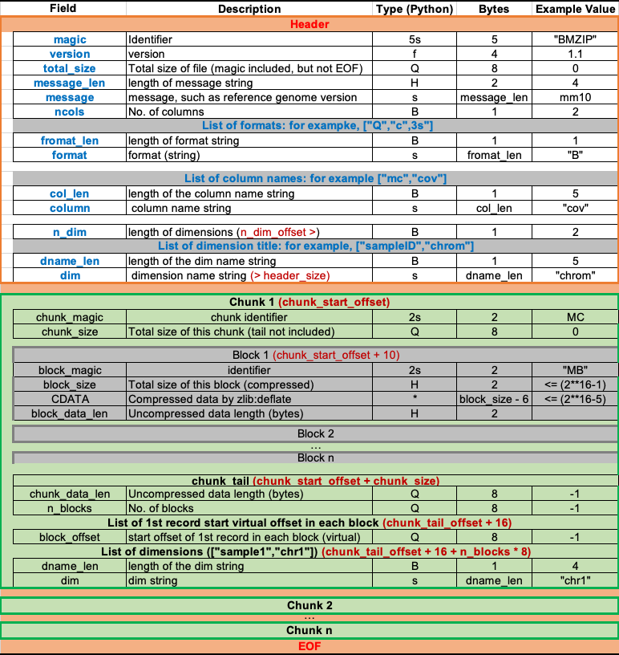

# Chunk ZIP

## Installation

```shell
pip install ChunkZIP
#or
pip install git+http://github.com/DingWB/czip
```

## Implementation

|                                  | allcools | ballcools | czip |
| -------------------------------- | -------- | --------- | ----- |
| Format                           | .tsv.gz  | .ballc    | .cz   |
| Compression algorithm            | bgzip    | bgzip     | czip |
| Support Random Access ?          | Yes      | Yes       | Yes   |
| Need extra index file for query? | Yes      | yes       | No    |
| Quickly Merge?                   | No       | No        | Yes   |




## Usage

[Documentation](https://dingwb.github.io/czip)